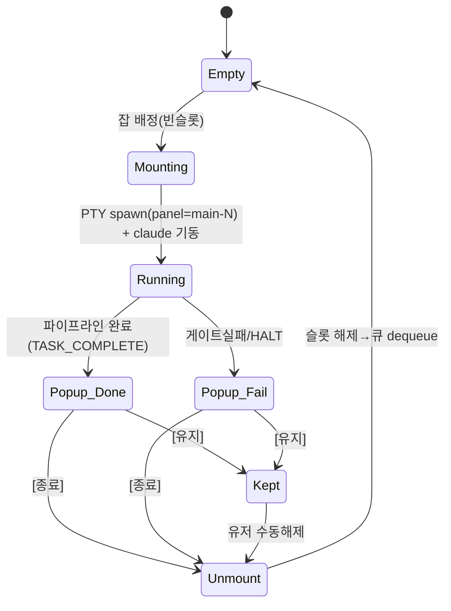
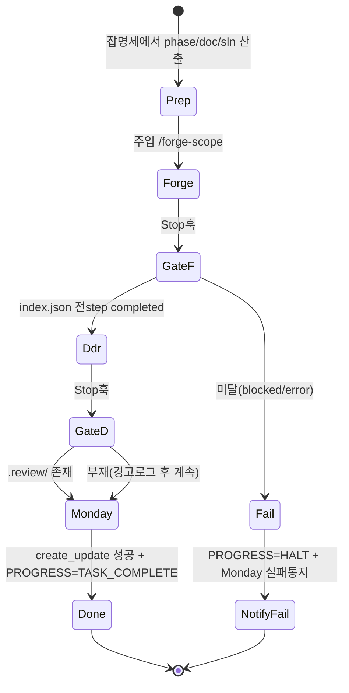
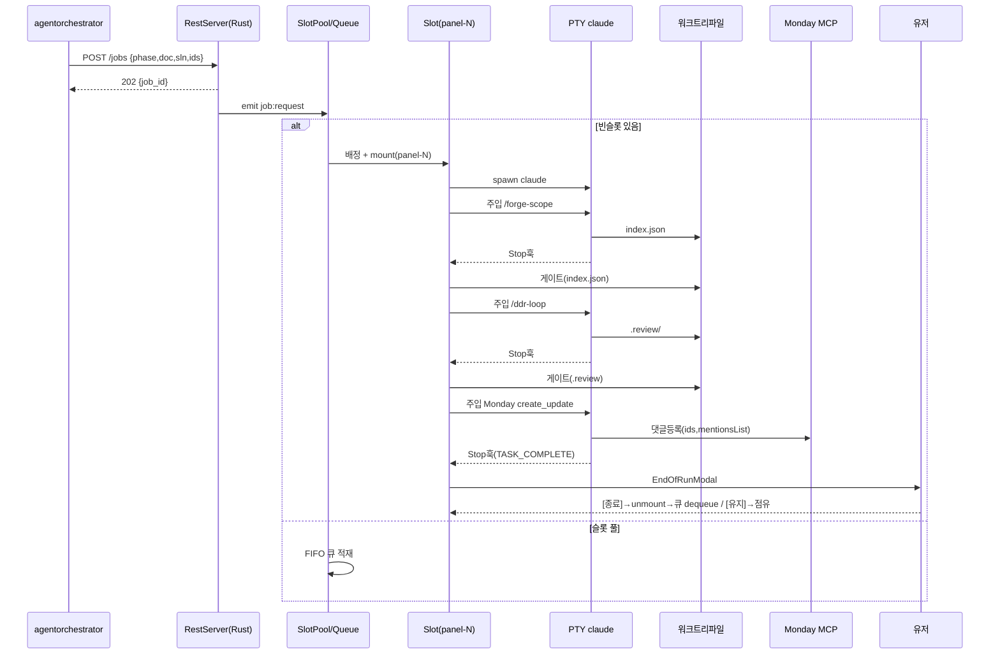

# Pipeline Architecture — Sidabari4Loop 슬롯풀 REST 서버

> 상태: 설계 확정(2026-06-20). 구현 전. 본 문서는 의사결정 기록 + 권고 아키텍처.
> 관련: `SIDABARI4LOOP_SPEC.md`(기존 단일패널 사양), `CLAUDE.md`(작업규칙).

## 0. 목표

Monday 명령 → Slack 전송 → Slack봇(agentorchestrator) → **Sidabari4Loop(REST 서버)가
doc-add-task·forge-scope·ddr-loop 를 직접 구동** → Monday 댓글, 까지 도는 단일 루프
파이프라인. 파이썬 중간 래퍼(develop-small.py)와 단계별 `claude -p` 새 spawn 제거.

## 1. 확정된 전제 (사용자 결정)

- Sidabari4Loop 는 **상시 ON**. 앱 자체가 **REST API 서버**. 봇이 앱을 실행시키지 않음.
- 봇 ↔ 앱 = **REST(요청 시에만)**. 봇이 클라이언트로 `POST /jobs`. 상시연결(WS) 아님.
- 잡 처리 = **슬롯 풀**. 윈도우 1개에 N분할, 각 칸 = 시다바리포루프 인스턴스 1개(독립 PTY claude 세션 + 자기 루프).
- 동시 N개. 초과분 → **FIFO 큐** → 슬롯 비면 dequeue.
- 완료/실패 → **슬롯별 팝업**. [종료]=칸 내림(슬롯 해제) / [유지]=점유 유지.
- **유지 = 슬롯 잠식(의도)**. 가용슬롯 감소 → 큐 적체는 유저가 수동해제로 푼다.
- **N=2 로 시작**(리소스). `config.slots`(기본 2)로 두고 추후 4까지 확장.
- **Hook 콘솔 = 공용 1개, 최우측**. 전 슬롯 이벤트를 panel_id 태그로 머지 표시.

## 2. 레이아웃 (N=2)

```
┌──────────────────── 윈도우 1개 = REST API 서버(상시 ON) ────────────────────┐
│  ┌─────────────────────┐  ┌────────────────────┐                            │
│  │ slot1  panel=main-1 │  │                    │                            │
│  │  PTY claude 세션     │  │   공용 Hook 콘솔    │                            │
│  │  PipelineController  │  │   (최우측)          │                            │
│  ├─────────────────────┤  │  panel별 태깅 머지   │                            │
│  │ slot2  panel=main-2 │  │  [main-1] forge…    │                            │
│  │  PTY claude 세션     │  │  [main-2] ddr…      │                            │
│  │  PipelineController  │  │  [SYSTEM] 큐…       │                            │
│  └─────────────────────┘  └────────────────────┘                            │
└──────────────────────────────────────────────────────────────────────────────┘
   ▲ POST /jobs (봇이 필요할 때만)   초과분 → FIFO 큐
```

## 3. 컴포넌트 책임

| 컴포넌트 | 위치 | 책임 | 신규/재사용 |
|---|---|---|---|
| RestServer | Rust(axum) | 127.0.0.1 바인드, `/jobs` 접수→검증→`emit("job:request")` | 신규 |
| JobQueue + SlotPool | 프론트(Zustand) | 슬롯 N 상태, 빈슬롯 배정, 초과 FIFO 큐, dequeue | 신규 |
| Slot | 프론트 | {panel_id, status, job, PTY, controller} 1세션 격리 | 패널 복제 |
| PipelineController | 프론트 | Stop훅→단계게이트→다음주입(forge→ddr→monday) | 신규(Supervisor 인프라 재사용) |
| HookBridge | 프론트 | 이벤트 panel_id로 해당 슬롯 라우팅 | 확장 |
| 공용 ConsolePanel | 프론트 | 전 슬롯 이벤트 머지표시(panel_id 태그) | 확장 |
| EndOfRunModal | 프론트 | 완료/실패 슬롯별 팝업 [종료]/[유지] | 신규(GateModal 패턴) |
| PTY / hooks_bus / audit / read_project_text | Rust | 구동·이벤트·게이트읽기 | 재사용(panel_id 이미 태깅) |

## 4. 파이프라인 (슬롯 내부)

한 슬롯의 영속 PTY claude 세션에 슬래시커맨드 순차 주입(ptyWrite + 브래킷페이스트):

```
주입① /claudecode-for-me:forge-scope <phase> --doc … --sln …
   └ 게이트: read_project_text(.worktrees/<phase>/phases/scoped/<phase>/index.json) 전 step completed?
주입② /claudecode-for-me:ddr-loop <doc> --worktree feat-<phase> --scope branch …
   └ 게이트: .review/<stem>-review.md 존재?
주입③ Monday MCP create_update(board/item/update_id, 리뷰본문, mentionsList)
```

게이트 판정 = sidabari Rust 파일읽기(LLM 자기보고 불신 원칙 보존, 기존 develop-small.py 의 결정적 게이트 계승).
doc-add-task = 별도 스킬 아님 — 잡 명세에서 phase/doc/sln 산출하는 Prep 전처리로 흡수.

### 슬롯 생명주기



### 잡 파이프라인 상태



## 5. 전체 시퀀스



## 6. REST 엔드포인트(안)

| 메서드 | 경로 | 동작 | 응답 |
|---|---|---|---|
| POST | `/jobs` | 잡 명세 접수→큐 적재(상한 10). 포화 시 거부+Monday 실패 댓글(QUEUE_FULL) | `202 {job_id, queued_pos}` / `4xx` |
| POST | `/jobs/queue:clear` | 대기 큐 전체 비우기(실행중 슬롯 무관) | `200 {cleared_n}` |
| GET | `/jobs/{id}` | 상태 조회(선택) | `{status, slot, phase, step}` |
| GET | `/health` | 헬스체크 | `200` |

> 취소 엔드포인트 없음 — 수동 PTY 입력(ADR-005). 단계 타임아웃 7200s, 재시작 시 슬롯·큐 휘발(ADR-004). 정식 계약 SSOT = docs/SLOTRUNNER(FRD/ADR), 본 표는 설계 메모.

비동기 모델: forge+ddr 최대 ~1시간이라 POST 블로킹 불가. 즉시 202 반환, 백그라운드 수행,
결과 통지는 **Monday 댓글**(봇 역류 불필요).

잡 명세 스키마(예):
```json
{ "phase":"loader-task-001", "doc":"Docs/.../task-001.md", "sln":"Src/....sln",
  "test_target":"Src/....csproj", "prompt":"...",
  "board_id":"...", "item_id":"...", "update_id":"..." }
```

## 7. 신규 의존 (사전승인 대상)
- Rust: `axum`(또는 `tiny_http`) + `tokio` — REST 서버. (SPEC §2 에서 제거됐던 tokio 일부 복귀)
- 보안: 127.0.0.1 전용 바인드, 외부 인터페이스 금지. serde 스키마 검증. 외부텍스트=데이터(운영프롬프트 변환만). 시크릿 미수신.

## 8. 구현 슬라이스 순서

| # | 슬라이스 | 검증 포인트 | 리스크 |
|---|---|---|---|
| 1 | REST 뼈대 `/health`+`/jobs`(echo→콘솔) | 봇 POST→앱 수신 | 신규의존 |
| 2 | 단일슬롯 주입 1발(`echo`) | ptyWrite 배관 | 낮음 |
| 3 | forge 주입 + index.json 게이트 | PTY서 forge 동작 | 높음 |
| 4 | ddr 연결 | PTY 인터랙티브 ddr | 높음 |
| 5 | Monday create_update | 세션 MCP 상속 | 중 |
| 6 | EndOfRunModal 팝업 | 종료/유지 | 낮음 |
| 7 | 2슬롯 풀 + 큐 + 공용콘솔 라우팅 | 동시2·panel_id 분기 | 중 |
| 8 | 4분할 확장(N=4) | 리소스 | 보류(2 검증 후) |

## 9. 미검증 리스크 (확신도)
- 3·4 PTY서 forge/ddr 동작 — 낮음(미실행). 1회 실측이 분수령. 현 스킬규칙이 헤드리스 `-p`
  가정이라 PTY 인터랙티브서 AskUserQuestion/run_in_background 가 살아날 수 있음 → 운영프롬프트에
  헤드리스 금지규칙(`_FORGE_RULES`/`_DDR_RULES` 상당) 박제 필요.
- 세션 Monday MCP 로드 — 중상(전역 `~/.claude.json` 배선 확인, 런타임 미실측).
- claude 2세션 동시 리소스 — 중(N=2 로 완화).

## 10. 코드 근거 (구현 시 참조)
- 봇 수신·큐·취소: `agentorchestrator/app.py`, `orchestrator.py`, `tools/develop-small.py`(파이프라인 원형).
- forge 게이트 판정 로직: `develop-small.py:_phase_status` (index.json), `:_ddr_review_path` (.review).
- 기존 단일 PTY·Supervisor·주입: `sidabari4loop` SPEC §3.1/§3.5, `src/lib/supervisor.ts`(ptyWrite/브래킷페이스트), `src-tauri/src/{pty,hooks_bus,supervisor}.rs`.
- panel_id 라우팅 토대: `SIDABARI4LOOP_PANEL_ID` env, `hooks_bus` classify, `audit_log`.
